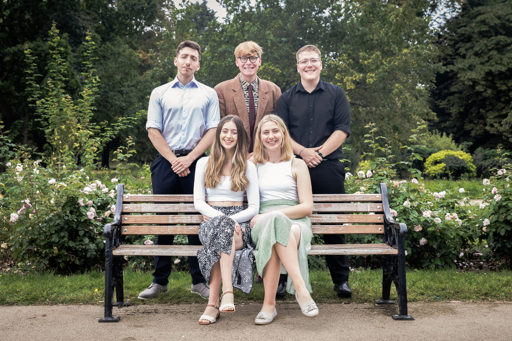
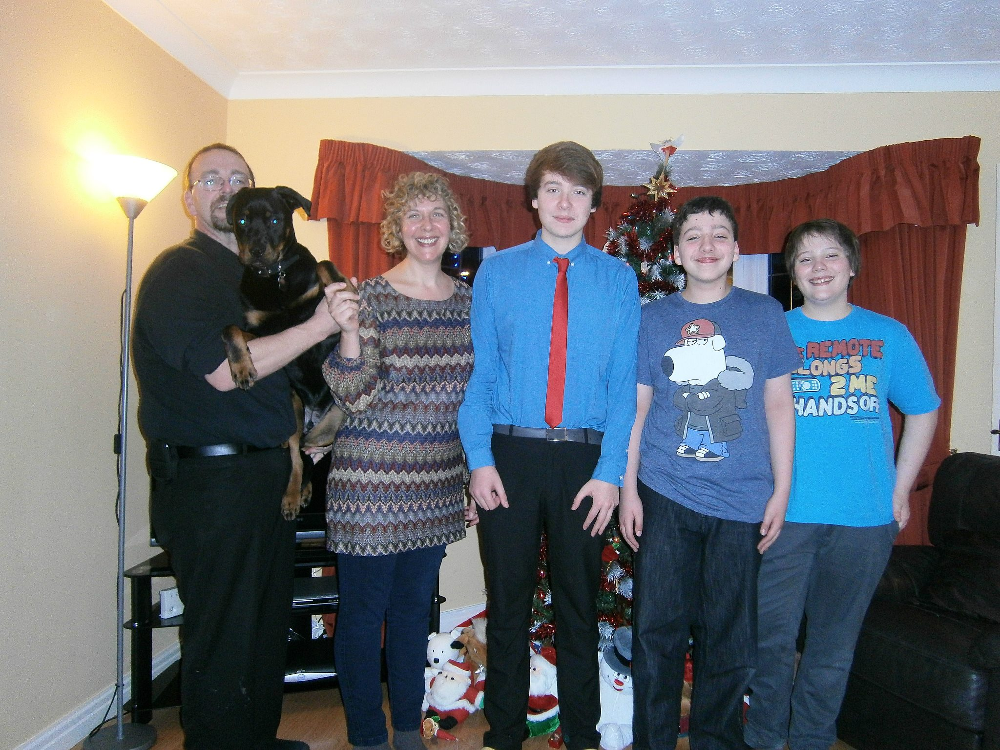

```{r setup, include=FALSE}
knitr::opts_chunk$set(echo = TRUE)
```

```{r, message=FALSE, warning=FALSE, echo=FALSE, fig.align="center", out.width = "100%"}
library(magick)
img <- image_read("pics/hq720.jpg")
image_write(img, path = "pics/hq720.jpg", format = "jpeg")
knitr::include_graphics("pics/hq720.jpg")
```
<br>


# <span style="color:blue;">⭐**Wishing You All A Very Happy Holiday Season!**⭐</span><br>

## To family both *immediate* and *extended*, wishing you all a <span style="color:red;">**Merry Christmas**</span>, a <span style="color:green;">**Happy New Year's**</span>, and a 2025 full of opportunities and excitement! 
<br>

## To all the memories we have made ...
<br>

{width=70%}

<br><br><span style="font-size: 50px;">❄️️️</span>
<br><br>

{width=70%}

<br><br><span style="font-size: 50px;">🎄️️</span>
<br><br>

{width=70%}

<br><br><span style="font-size: 50px;">☃️️</span>
<br><br>

{width=70%}

<br><br><span style="font-size: 50px;">🎁️️</span>
<br><br>

{width=70%}

<br><br><span style="font-size: 50px;">🎅️
<br><br>

{width=70%}

<br><br><span style="font-size: 50px;">❄️️️</span>
<br><br>

{width=70%}

<br><br><span style="font-size: 50px;">🎄️️</span>
<br><br>

{width=70%}

<br>

## And to all of those yet to come!

## With all of my love,
# ~ Jacob 