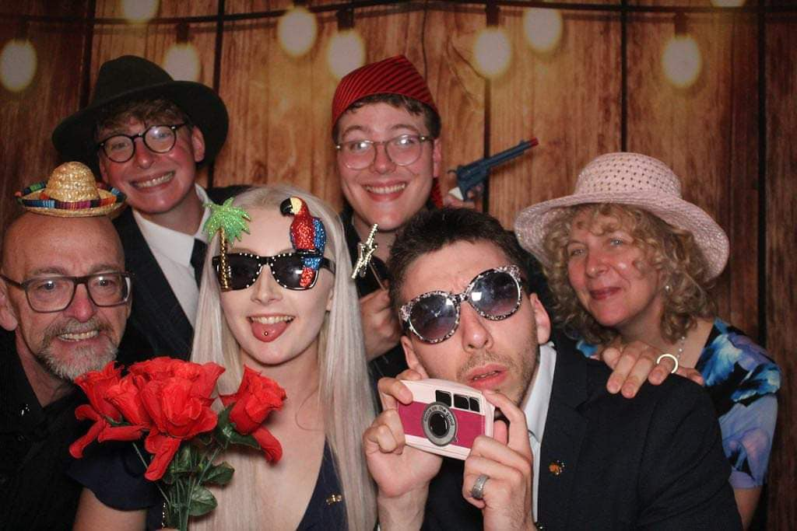

```{r setup, include=FALSE}
knitr::opts_chunk$set(echo = TRUE)
```

<button onclick="document.getElementById('spotify-player').src += '&autoplay=true';">Play Music</button>
<iframe id="spotify-player" style="border-radius:12px" 
        src="https://open.spotify.com/embed/track/2TE4xW3ImvpltVU0cPcKUn?utm_source=generator" 
        width="100%" height="152" frameBorder="0" 
        allow="autoplay; clipboard-write; encrypted-media; fullscreen; picture-in-picture" 
        loading="lazy"></iframe>

```{r, message=FALSE, warning=FALSE, echo=FALSE, fig.align="center", out.width = "100%"}
library(magick)
img <- image_read("pics/hq720.jpg")
image_write(img, path = "pics/hq720.jpg", format = "jpeg")
knitr::include_graphics("pics/hq720.jpg")
```
<br>


## <span style="color:blue;">⭐**Wishing You All A Very Happy Holiday Season!**⭐</span><br>

  To family both *immediate* and *extended*, wishing you all a <span style="color:red;">**Merry Christmas**</span>, a <span style="color:green;">**Happy New Year's**</span>, and a 2025 full of opportunities and excitement! <br>

{width=70%}


❄️
🎁
✨
🎄
🎅
☃️
🌟
⭐